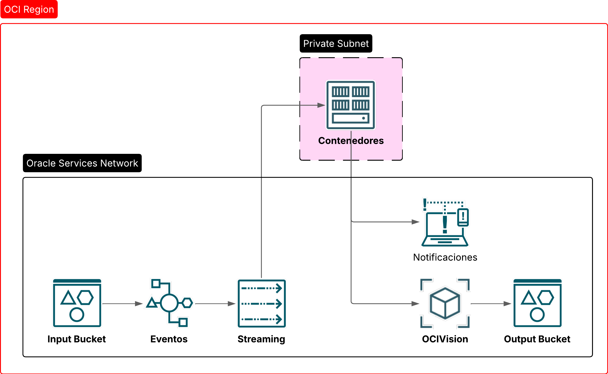

# OCI | Resource principal with Container Instance + OCI Vision

El repositorio contiene una demo de un contenedor, corriendo una app FastAPI conectado con OCI Streaming (Apache Kafka), para ejecutar video jobs en OCI Vision.



---

## Commands

### OCI Container Instance

```sh
# 1. Construir imagen
docker build -t call-oci-vision-func:latest .

# 2. Iniciar sesión con OCI Registry (opcional)
docker login -u <object-storage-namespace>/<oci-username> <oci-region-key>.ocir.io
# Usar Auth Token de password...

# 3. Pushear imagen
docker push call-oci-vision-func:latest
```

<!-- ### OCI Function

```sh
# tbd
``` -->
